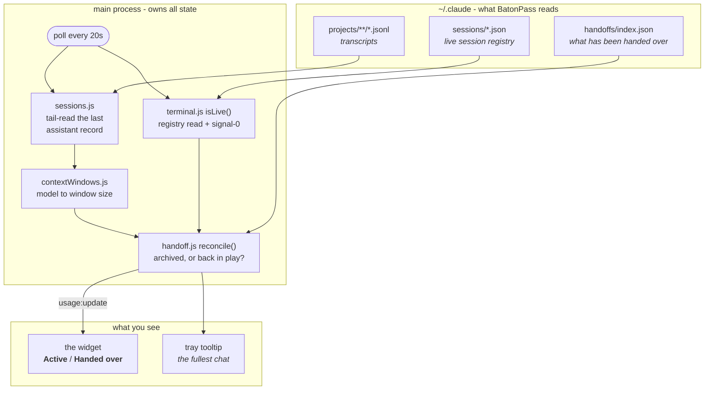
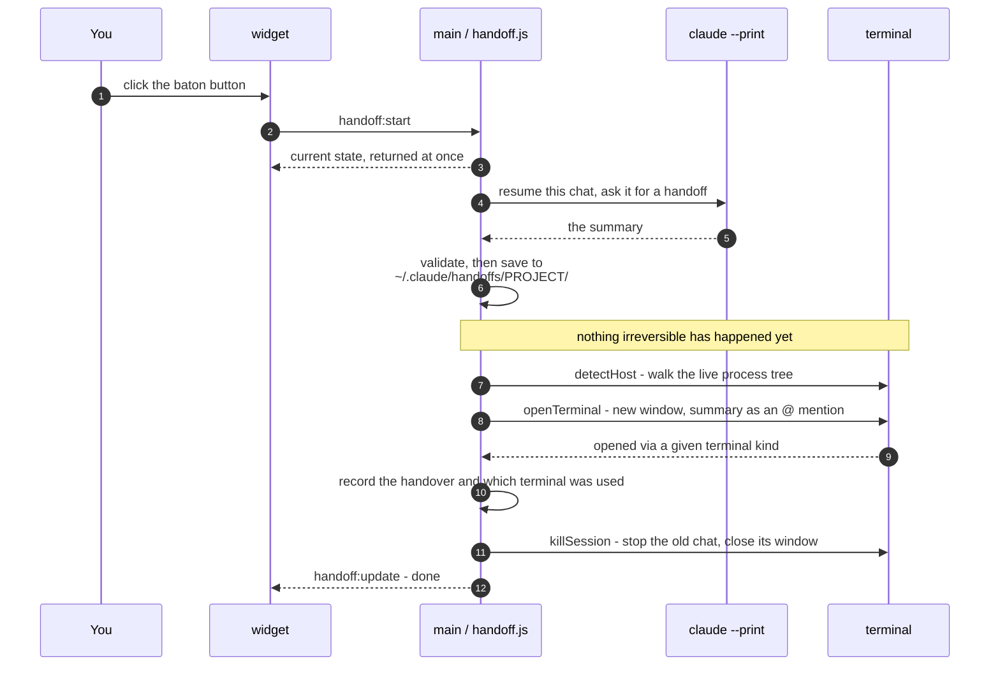
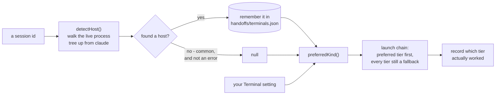

# BatonPass

A tray / menu-bar desktop widget for Claude Code that does two things:

- **Shows how full each of your chats is** - how many tokens of its context
  window a conversation has used, and how close it is to running out of room.
- **Hands a chat off before it does.** One click summarises the conversation,
  saves the summary, opens a fresh session in a new terminal already holding it,
  and stops the old one.

The baton is the summary; passing it is the whole point. Personal-use tool.

## How it works

Everything comes from local files. There is no sign-in, no API key, and no
networking code anywhere in the app.



The main process owns all state and broadcasts it, so no two windows can
disagree. Renderers talk back over a single preload bridge, `window.batonPass`
([`preload.js`](preload.js)).

## Reading the context

A chat's current context is the last assistant record's `input_tokens +
cache_read_input_tokens + cache_creation_input_tokens`. Output tokens are
deliberately excluded: they reappear as input on the following turn, so counting
both would double them.

Three details that are easy to get wrong, all found by reading the real files:

- **`apiBlockIndex` is not a compaction marker.** It cycles 0-1-2-0 *within a
  single turn* - one entry per API call in a multi-tool turn. Context is constant
  across a turn and grows between turns, so the last record is the current state.
- **Records with model `<synthetic>` must be skipped.** Interrupts and errors are
  written as assistant records with a placeholder model and zeroed usage. Reading
  one as the current state reports an empty context for a session that is full;
  this is what made two transcripts appear to drop to zero when the data was
  first surveyed.
- **Only the tail of each file is read** (`TAIL_BYTES` in
  [`lib/sessions.js`](lib/sessions.js)). Transcripts here run past 10 MB and only
  the final record matters. Verified against a naive full-file scan on every
  transcript on disk: 36 of 36 identical, 9.4x faster. A tail that somehow holds
  no usable record falls back to reading the whole file.

Chats are listed when they were touched in the last 24 hours, most recent first,
capped at six rows with a `+N more` line below. The top row is marked as current
- the closest thing to "the chat you're in" that a separate process can know,
since it cannot see which editor window has focus. Unchanged files are served
from an mtime-keyed cache, so a poll only re-reads a transcript that actually
grew: a full scan costs ~6 ms cold and ~1 ms warm.

### The limit is a published number, not a guess

[`lib/contextWindows.js`](lib/contextWindows.js) maps a model to its context
window - 1M for Opus 5, Sonnet 5, Opus 4.6-4.8, Sonnet 4.6, Fable and Mythos;
200k for Haiku 4.5 and for anything unrecognised. First match wins, so **order is
load-bearing**: `/haiku/` has to precede anything broader.

The widget always prints `353k / 1M` rather than a bare percentage, so a
denominator this table gets wrong shows up on screen as an implausible figure
instead of silently skewing the bar.

This is the reason the app measures context rather than plan quota. A context
window is a published property of the model, so nothing here is estimated and
nothing is learned - unlike a plan limit, which Anthropic does not publish and
which could therefore only ever be guessed at.

**One caveat.** Claude Code auto-compacts before the hard window (`--autocompact`
accepts 100k-1M, default `auto`), so the real ceiling may be lower than the
model's window. The percentage is an honest upper bound, not a countdown to
compaction. For what it is worth, no session on this machine has ever compacted -
the largest reached 541k of 1M.

### The colour scale

`CONTEXT_BANDS` in [`renderer/widget.js`](renderer/widget.js) sets where the bar
changes colour, as a percentage of the model's context window. Colour and bar
length say the same thing - how full the window is - so they can never disagree:

| band | % of window | on a 1M model | on a 200k model |
|---|---|---|---|
| green | under 40% | under 400k | under 80k |
| amber | 40% | 400k | 80k |
| orange | 60% | 600k | 120k |
| red | 80% | 800k | 160k |

Percentages rather than fixed token counts, so a 200k model - which has
proportionally less room to begin with - warns proportionally earlier. Edit the
three numbers to taste; they are in one place.

## Handing off a chat

Every row carries a `⇥` button. One click runs this:



Ordering is the safety property. Every step that can fail runs before any step
that changes something:

```
summarise -> validate -> save -> launch -> mark -> kill
```

An empty summary writes no file and kills nothing. A terminal that won't open
leaves the file on disk *and* leaves the old session running, and a second click
retries only the launch rather than paying for the summary again.

**The summary is written by the chat itself, not by this app.** Nothing parses
the transcript and paraphrases it - that would produce a much poorer summary from
much less understanding. Instead [`lib/claudeCli.js`](lib/claudeCli.js) runs

```
claude --print --resume <sessionId> --fork-session …
```

which replays that exact conversation, then asks it for a handoff. `--print` is
the windowless part, `--fork-session` keeps the run out of the live session's
transcript, and `--resume` is what supplies the context - all of it. Nothing is
dropped. There is no supported way to type into a running terminal session, so
this is the closest equivalent: the same conversation, asked the same question,
just not on screen.

**The flag list is chosen to preserve the live session's prompt cache**, which is
the entire cost story. Caching is a prefix match rendered `tools -> system ->
messages`, reads bill at ~0.1x and writes at ~1.25x, so anything that disturbs
the prefix re-bills the whole transcript. Two flags are therefore deliberately
absent or pinned: there is no `--tools ""` (tool definitions sit at position 0,
and dropping them misses everything after), and `--model` is always the chat's
own model, because caches are model-scoped. A measured run came back 81% cache
read.

The prompt lives in `~/.claude/commands/handoff.md`, written once on first run
and never overwritten, so its wording can be edited freely - and `/handoff`
becomes typeable by hand in any session. The summary lands in
`~/.claude/handoffs/<project>/`, deliberately outside `~/.claude/projects/` so
this app's own scanner can never mistake one for a chat.

The new session receives the file as an `@` mention, which Claude Code expands
into context before the first turn. That keeps the launch argument to a single
space-free token - the document itself would otherwise have to survive three
command-line parsers and an ~8191 character ceiling.

**The old chat is stopped, never deleted.** Its transcript stays on disk, so
`claude --resume <id>` brings it back if the handoff turns out to be thin. The
handover is recorded in `~/.claude/handoffs/index.json`; nothing is ever written
into Claude Code's own transcripts.

## How it talks to terminals

This is the part with the most machinery behind it, because a windowless GUI
process opening a *visible* terminal is not a thing either OS makes easy.
[`lib/terminal.js`](lib/terminal.js) is the Windows half and the entry point;
[`lib/terminalMac.js`](lib/terminalMac.js) is the macOS half, delegated to on
darwin with identical arguments and return shapes so callers never branch.



**Detection frequently has no answer, and that is normal.** Hosts exit while
their shells live on, and the list includes chats with no process at all. Every
launch tier stays a fallback rather than a dependency, so a handoff never fails
over a cosmetic preference.

### Launch tiers

| platform | tiers, in base order | notes |
|---|---|---|
| Windows | Windows Terminal → `cmd` | Git Bash is never guessed at - only used when detected or chosen |
| macOS | Terminal.app | iTerm2 only when both detected/chosen *and* installed |

`prefer` (from detection, or from your Terminal setting) pulls its tier to the
front. A `prefer` naming no tier - `auto`, or a detected `vscode` - simply falls
through to the base chain.

### What dies when a chat is stopped

`taskkill /T` and its macOS equivalent reach descendants only, so the boundary is
the highest process whose death is safe. What is safe depends on how much the
host is holding:

| host | boundary | what closes |
|---|---|---|
| mintty (Git Bash) | the host itself | that window - it is one window per process |
| Windows Terminal | the shell below it | that tab; its siblings survive |
| Terminal.app / iTerm2 | the shell below it | that tab, matched by tty; the app is never killed |
| VS Code | never the host | only claude stops; the editor is untouched |
| no host detected | the session | just the chat |

On macOS the window is closed by matching its tty rather than by killing the app,
and claude is killed first so only the shell is left in the tab - which is what
stops Terminal's "a process is still running" sheet from appearing. The subtree
kill is the backstop so nothing is orphaned.

### Windows traps, and what the code does instead

None of these are outstanding bugs. Each is a place where the obvious approach
fails *silently* - no error, no window, nothing in a log - so each is a note on
why the code takes the longer route.

- `wt.exe` is an App Execution Alias. `fs.existsSync` and `fs.statSync` both
  return **EACCES** on it, so the obvious check reports "not installed" on a
  machine where it is. Only `accessSync(X_OK)` works.
- `start` will not take a forward-slash path. Given one it **exits 0 and launches
  nothing** - no error, no window.
- `detached: true` means `DETACHED_PROCESS` on Windows, not `CREATE_NEW_CONSOLE`,
  so a detached shell gets no console at all. That is why the fallback tier goes
  through `start` rather than spawning a shell.
- A pid is not an identity. Windows reuses them, so every kill is gated on the
  image name *and* the creation time recorded in `~/.claude/sessions/<pid>.json`.
  Those two clocks do not match exactly - a FILETIME is 100-nanosecond and
  `Win32_Process.CreationDate` only microsecond, so the last digit differs and
  the comparison carries a millisecond of tolerance.
- `git-bash.exe --command=` runs the command but **opens no window for it**. A
  probe that only wrote a file passed; claude, which needs a terminal, launched
  invisibly and exited at once. Git Bash is driven through `mintty.exe` instead,
  in the form a real Git Bash window is started with.

**Windows process ancestry cannot find a Git Bash window.** MSYS emulates
`fork()`, the intermediate process exits, and `Win32_Process` reports the shell's
parent as a dead pid - measured on a live session whose real chain was
`git-bash → mintty → bash → bash → claude`. MSYS keeps its own table, and
`usr/bin/ps.exe -W` reports both the MSYS pid and the Windows pid, so walking
`PPID` there recovers what Windows loses. Detection tries Win32 ancestry first
(which resolves VS Code and Windows Terminal cleanly) and falls through to MSYS.

### macOS traps, and what the code does instead

- **A GUI process can't spawn a terminal with a command** - the emulator has to
  be told, over Apple events, to open a window and run something. Terminal.app is
  driven with `do script`, iTerm2 with `create window` + `write text`, both
  through `osascript`. Spawning a shell directly is the same trap as
  `git-bash.exe --command=`: no window.
- **Apple events need Automation permission.** The first launch raises a system
  prompt; a denial comes back as osascript error **-1743** ("Not authorized to
  send Apple events"), which is surfaced as *"macOS blocked BatonPass from
  controlling the terminal - allow it under System Settings → Privacy & Security →
  Automation"* rather than a launch that silently did nothing.
- **Detection walks the process tree with `ps`**, matching the app bundle in the
  full command line (`claude → -zsh → login → Terminal|iTerm2`).

### Known limitations

Unlike the two sections above, these are things the app genuinely does not do.
Both are deliberate, and neither is fixable from here:

- **A VS Code chat's successor opens in Windows Terminal, not in VS Code.** The
  `code` CLI cannot open an integrated terminal running a given command, so there
  is nothing to launch into. The old session still stops cleanly and the editor
  is left untouched.
- **On macOS, a node-based dev install of claude is invisible to detection.** It
  runs as `node …/cli.js`, which doesn't match `isClaude`, so that setup gets no
  host detection and no kill. It costs a fallback launch rather than correctness -
  the check can never match the wrong process, which is the safe direction to be
  wrong in.

## The two tabs

**Active** is the live list. **Handed over** is everything that has been handed
off, newest first, and it persists until you delete it. Handed-over rows carry no
context bar - the chat is stopped and its fill is frozen, so a live-looking bar
would be claiming something untrue - and offer two actions:

- **↺ Reopen** runs `claude --resume <id>` in the terminal that chat was last
  opened in, recorded at handoff time from what the app actually used rather than
  from a guess.
- **✕ Delete** removes it permanently.

A handed-over chat that gets written to again - reopened from that tab, or
resumed by hand - **returns to Active on the next poll**. Going back to a chat
un-archives it.

Two signals decide that, not one. Transcript mtime is the cheap trigger, since
the rows already carry it, but mtime alone lies at exactly this moment: stopping
a session makes it flush one last time, and that write lands seconds later with
no process behind it. Measured at ~5s past the baseline on a 1 MB transcript.
So the chat also has to be *live* again - `isLive()`, a registry read and a
signal-0 - which is what tells a real return apart from a corpse's last write.
The baseline itself is the mtime taken *after* the old session is stopped.

## Reopening a chat whose terminal was closed

An Active row with no process behind it is a chat whose window you closed. It
says `terminal closed` in its meta line and grows a `↺` button that opens it
again, in the terminal it was last seen in.

Knowing which terminal that was is an ordering problem: detection walks the live
process tree, so by the time the window is gone there is nothing left to walk.
[`lib/terminalMemory.js`](lib/terminalMemory.js) solves it by learning the answer
while the chat is still running and writing it to
`~/.claude/handoffs/terminals.json`. Detection costs a subprocess, so it happens
once per chat rather than on every poll, deferred so the panel updates first.

A handoff picks its successor's session id up front (`--session-id`) rather than
letting the CLI choose, so the brand-new chat's terminal can be recorded the
moment it opens - otherwise the one chat guaranteed to need this button would be
the one nothing could ever know about.

**Opening a terminal only proves a terminal opened.** A transcript killed
mid-write can leave a session the CLI refuses to resume (`No deferred tool marker
found in the resumed session`), and the window then falls back to a shell prompt.
So a reopen waits for the chat to actually register before reporting success, and
says so plainly when it doesn't.

## Deleting a chat

The `✕` on any row deletes it completely, after a dialog naming the chat. This is
the only irreversible thing the app does, and the only place it asks first. The
dialog is its own centered, always-on-top window
([`renderer/delete-confirm.html`](renderer/delete-confirm.html)) - a confirmation
you can lose behind another window is worse than none, because the delete you
asked for then simply never happens. Cancel holds focus, not the destructive
button.

A chat is not one file, which is the whole reason
[`lib/sessionFiles.js`](lib/sessionFiles.js) exists: the transcript, the
directory of subagent transcripts beside it, `file-history/<id>/`,
`session-env/<id>/`, the live registry entry, and its lines in the shared
`history.jsonl`. Deleting only the `.jsonl` leaves most of that behind.

Two rules hold it up. The session id is validated as a UUID before it goes
anywhere near a path, and nothing is removed unless its own name is exactly that
id - because `projects/<slug>/` holds `memory/` too, which belongs to the project
and must never be touched. `history.jsonl` is rewritten rather than removed,
since every session writes to it, and lines that don't parse are kept verbatim
rather than dropped for being unfamiliar.

The saved handoff summary is **kept** - deleting a chat shouldn't destroy the
record of what it was for.

## The windows

Three, all frameless and system-tinted:

- **The widget** ([`renderer/widget.html`](renderer/widget.html)) is on screen
  for as long as BatonPass is running. It never closes on its own and is dragged
  by its header. It deliberately does **not** float above other windows - it is a
  desktop widget, not an overlay - and `skipTaskbar` keeps it out of the taskbar
  and alt-tab. Its position is written to the settings file on every move and
  restored on launch, unless that spot no longer lands on a display that exists,
  in which case it parks top-right of the primary screen again.
- **The settings flyout** ([`renderer/settings.html`](renderer/settings.html))
  behaves like a tray popover: click the tray icon to open it, and it closes as
  soon as it loses focus. The widget has no settings button; the tray icon is the
  way in.
- **The delete confirmation**, described above, which exists only while it's up.

Each window reports its own content height and main resizes it to fit, so hiding
a section shrinks the window instead of leaving empty space. Both persistent
windows share [`renderer/style.css`](renderer/style.css) and
[`renderer/shared.js`](renderer/shared.js) - theme tokens, contrast maths, and
the auto-fit reporter.

Right-click the tray icon for "Settings", "Refresh now" and "Quit". The tray
tooltip reports the *fullest* active chat rather than the most recent one, since
the session about to run out of room is often not the one in front of you.

## Settings

Click the tray icon. Three groups:

**Colour.** One picker, for every mark in the panel: the context bars,
checkboxes and the primary button. It applies live while the picker is open -
the widget is a separate window, so the accent is broadcast over IPC before
anything is committed to disk.

The default is phthalo green - a lifted step (`#12a37d`) rather than the true
pigment hex, since `#123524` measures 1.29:1 against the panel, i.e. invisible.
If your accent lands under 3:1 against the panel the flyout says so and gives the
ratio. It reports; it doesn't stop you. The primary button's label also flips to
dark type against a pale accent.

**Terminal.** Where handed-off and reopened chats open. *Automatic* uses the
terminal each chat was last seen in; any other value only reorders the launch
chain, so a choice the machine can't satisfy still opens something. The menu is
built from the terminals actually installed
([`availableTerminals()`](lib/terminal.js)), so it never offers one that isn't
there - and a previously chosen terminal that has since been uninstalled is kept
in the list, flagged `(not installed)`, rather than silently showing the wrong
value as selected. The whole group hides on a platform that can't open a
terminal at all.

**Startup.** Registers the app as a login item
([`lib/startup.js`](lib/startup.js)): a `Run` registry entry on Windows, a login
item on macOS. The OS is the source of truth - the checkbox re-reads it every
time the flyout opens, so removing the entry from Task Manager or System
Settings shows up here too. Running from source, the entry points at
`electron.exe` with the project directory as an argument; in a packaged build it
points at the installed executable. Enabling it in dev and then installing a
build means two entries - turn the dev one off first.

Every setting that main writes is echoed back to the renderer, so a value the
store rejected leaves the control showing the truth rather than the attempt.

### Why the background isn't themed by the app

The panel paints no background of its own: on Windows the tint is DWM acrylic and
on macOS it's vibrancy, both of which follow the OS light/dark setting. Anything
opaque in CSS covers that up. What the app themes is the *ink* -
[`style.css`](renderer/style.css) carries a `prefers-color-scheme: light` arm so
text, borders and fields all flip when the OS does, and every ink token is an
alpha of `--ink` so the two arms are one edit.

The one exception to the single accent is the **status scale**. Amber, orange and
red are fixed rather than themed - they carry meaning, and they are the only
place those colours appear, so a warm bar always means "this chat is running out
of room".

### The glass

Both persistent windows are frosted, and on Windows that is **not** Electron's
`backgroundMaterial`. A DWM system backdrop goes flat grey the moment its window
stops being the foreground one - a desktop widget almost never is - and
Electron's `visualEffectState: 'active'`, the switch that would keep it on, is
macOS-only. Sampling the wallpaper and blurring it in CSS doesn't work either: a
live-wallpaper app (Wallpaper Engine and friends) paints the desktop itself and
writes no wallpaper file at all.

So [`lib/blurBehind.js`](lib/blurBehind.js) does what Rainmeter's `Blur` does:
calls the undocumented `SetWindowCompositionAttribute` with
`ACCENT_ENABLE_BLURBEHIND` through [koffi](https://koffi.dev), asking DWM to blur
what's behind the window directly. That survives losing focus and survives a live
wallpaper, because the compositor is doing the blurring.

Consequences, all of them load-bearing:

- **The windows are `transparent: true`**, which blur-behind needs.
- **The corners are rounded by DWM**, via `DwmSetWindowAttribute` with
  `DWMWA_WINDOW_CORNER_PREFERENCE`. This is the part that isn't obvious: the blur
  covers the whole window *rectangle*, so CSS rounding alone leaves four square
  corners of glass behind the panel. A window region (`SetWindowRgn`) does **not**
  fix it - measured over a stripe pattern, the region clips the window's own
  pixels but leaves the blur square (corner contrast 60 vs 255 for untouched
  backdrop). Rounding the window through DWM does fix it, because then everything
  DWM composites for that window is rounded (corner contrast 181), and it brings
  back the window shadow a transparent window otherwise loses. It's an attribute,
  not a geometry, so it survives resizing untouched. `--radius` should stay at
  DWM's 8px so the page's own rounding matches.
- **DWM blurs, CSS tints.** The gradient colour is left at zero alpha so
  `--glass-tint` can carry the tint and follow the light/dark theme.
- **`koffi` is a runtime dependency** and is `asarUnpack`ed in the build - it
  loads a native binary, which can't be read from inside an asar.

Every call is best-effort: if the export moves or the load fails, the window just
isn't blurred and the panel falls back to its own tint.

## Run it

```bash
npm install
npm start
```

## The website

[`site/`](site/) is an Astro static site — the landing page that points at releases.
It lives in this repo on purpose: the downloads it links to are this repo's Releases, so
a split would mean reaching across repos for URLs that already live here.

```bash
cd site
npm install
npm run dev       # localhost:4321/BatonPass/
npm run build     # -> site/dist
npm run preview   # serves the build, with `base` applied
```

**`npm run preview` is the check that matters, not `dev`.** The site deploys to a
project page at `krlosdev.github.io/BatonPass/`, so [`astro.config.mjs`](site/astro.config.mjs)
sets `base: '/BatonPass'`. A missing `base` prefix works perfectly in `dev` and 404s
every asset once deployed. If a custom domain is ever added, `base` goes back to `/`.

Its images are derived from the same artwork the app icons come from:

```bash
npm run site:assets   # from the repo root
```

[`scripts/site-assets.js`](scripts/site-assets.js) crops `assets/BatonPassLogo.png` to
its own bounds, splits the mark from the lettering, builds the favicon out of the app's
tile, and rounds the corners of the screenshot in `assets/screenshots/`. It imports its
cropping and downsampling from [`scripts/derive-icons.js`](scripts/derive-icons.js), so
there is one implementation of that maths rather than two. The results go to
`site/src/assets/` rather than `site/public/` because Astro only optimises images it can
see as imports — that is what turns a 252 KB PNG logo into a 26 KB WebP.

Those derived images **are committed**, even though they are generated. The deploy
workflow builds only `site/`, and `astro build` resolves them as imports — so if they
weren't in the repo, CI would fail on a missing module. Re-run `npm run site:assets`
whenever the artwork or the screenshot changes, and commit what it writes.

Deployment is [`.github/workflows/site.yml`](.github/workflows/site.yml): a push to
`main` touching `site/**` builds and publishes to GitHub Pages. **This needs Pages set
to "GitHub Actions"** under Settings → Pages — with the default "Deploy from a branch"
the workflow runs, reports success, and changes nothing.

## Building installers

```bash
npm run build:win   # Windows (nsis + portable)
npm run build:mac   # macOS (dmg) - must be run on a Mac
```

Icons live in `assets/` and are **derived from source artwork**, not hand-
exported. `npm run icons` reads `assets/tray_icon.png`, crops the artwork out of
whatever canvas it was exported on, and writes all four shipped files:

| file | used for | how it's derived |
|---|---|---|
| `icon.png` | app / installer | 512×512, the artwork as drawn, padding and all |
| `tray-icon.png` | Windows tray | 32×32, cropped tight to the glyph, tile corners redrawn |
| `trayTemplate.png` | macOS menu bar | 16×16, **black + alpha only**, glyph only |
| `trayTemplate@2x.png` | macOS retina | 32×32, same rule |

**The tray crop is tighter than the app icon's, on purpose.** An app icon is
shown large enough that the artwork's own padding reads as design; a tray slot is
about 32px, where that same padding is just lost width. In this artwork the ring
fills 74% of the tile, so cropping to the tile left a 24px mark in a 32px slot -
noticeably smaller than its neighbours. Cropping to the glyph instead puts it at
30px. The tile's pixels still fill the crop behind the glyph, and its rounded
corners are redrawn at the new size, so it still reads as the boxed icon.

macOS is the one that can't keep the tile at all. A template image carries no
colour - only its alpha channel is used, and the OS tints the result - so an
opaque tile would render as a solid black rounded square with the glyph swallowed
inside it. The tile is dropped there and only the glyph survives.

The `*Template` suffix is what makes Electron treat those two as template images;
colour in them is discarded. `main.js` deliberately does **not** resize the image
it loads - `createFromPath` picks up the `@2x` file as a second representation,
and resizing collapses them into one bitmap, throwing the retina variant away.

**A design that reads at 512 rarely survives 16.** Fine interior detail turns to
mush in the tray, and the macOS template flattens everything to a single tint, so
colour can't do any separating work. If the app icon is detailed, draw a
simplified glyph for the tray - one shape, thick strokes - and pass it as a
second argument: `npm run icons -- assets/tray_icon.png assets/tray_glyph.png`.

`npm run generate-icons` is a separate fallback that fills in any **missing**
file with a placeholder circle and never touches existing ones. It runs on
`postinstall`, so derived icons survive `npm install`; `-- --force` overwrites.

## Licence

MIT - see [`LICENSE`](LICENSE).

## Notes

- Polling is every 20s and entirely local: files are re-read only when their
  mtime changes, and nothing leaves the machine.
- Settings live in `batonpass-settings.json` under Electron's `userData`
  directory. Keys the app no longer understands are dropped on the next launch.
- Running the app from inside a Claude Code tool call needs
  `env -u ELECTRON_RUN_AS_NODE npm start`. The VS Code extension host exports
  `ELECTRON_RUN_AS_NODE=1`, which makes `electron .` execute `main.js` as plain
  Node, where `require('electron')` returns a path string and `app` is undefined.
  A plain `npm start` from your own terminal is unaffected.
